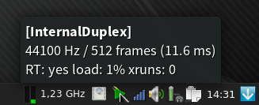

# jack-select

A systray application to quickly change the [JACK] configuration from
QJackCtl presets via DBus.

This application displays an icon in the system tray (also known as
notification area) of your desktop, which shows the status of the JACK audio
server and when you click on it, a menu pops up which lets you quickly select
from the JACK configuration presets you created with [QJackCtl]. When you
select a preset, its JACK engine and driver configuration settings are loaded
via DBus into JACK and then the server is restarted. This allows you to switch
between different audio setups with just two clicks.

When you hover with the mouse pointer over the systray icon and JACK is
running, a tooltip will show you the most important parameters of the current
setup.

Lastly, there are menu entries to stop the JACK server and to quit the
application.

To create or edit presets, just use QjackCtl and restart jack-select.

Requirements
------------

This application works with the DBus-version of JACK only.

It written in Python 3 using the [PyGobject] bindings for GTK 3. In addition to
`python-gobject` the following third-party Python libraries are required:

* [pyxdg](http://freedesktop.org/Software/pyxdg)
* [dbus-python](https://www.freedesktop.org/wiki/Software/DBusBindings/)

These may be available from the package repository of your distribution as
`python-xdg` and `python-dbus` respectively.

Python 2 is not supported.

[JACK]: http://jackaudio.org/
[PyGObject]: https://wiki.gnome.org/Projects/PyGObject
[QJackCtl]: http://qjackctl.sourceforge.net/
